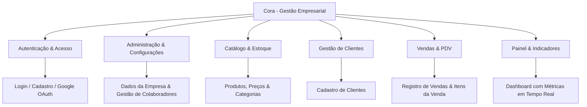

# 📋 Termo de Abertura do Projeto (TAP)
## Projeto Cora — Sistema de Gestão Empresarial e Comercial

---

### 📑 Informações do Documento

| Campo | Detalhe |
| :--- | :--- |
| **Nome do Projeto** | **Cora** (Sistema Integrado de Gestão Empresarial) |
| **Versão** | 1.0.0 |
| **Data de Elaboração** | 31 de Agosto de 2026 |
| **Status** | Em Desenvolvimento / Ativo |
| **Gerente do Projeto** | Átila V. |
| **Repositório** | [HaruSoftware/CoraReact](https://github.com/HaruSoftware/CoraReact) |

---

## 1. 🎯 Justificativa do Projeto

Micro, pequenas e médias empresas enfrentam constantes desafios na centralização de suas operações comerciais, como controle de estoque, cadastro de clientes, registro de vendas e gerenciamento de equipe. Processos manuais ou fragmentados geram retrabalho, perda de dados e lentidão no atendimento.

O **Cora** nasce com o propósito de oferecer uma solução moderna, fluida e intuitiva para unificar a gestão de negócios em um único ecossistema web, garantindo agilidade no fechamento de vendas, precisão no estoque e controle multi-usuário com arquitetura multi-tenant (múltiplas empresas/contas isoladas).

---

## 2. 🏁 Objetivos do Projeto

- **Centralização:** Disponibilizar em uma única plataforma web a gestão completa de produtos, categorias, clientes, vendas e colaboradores.
- **Segurança e Isolamento Multi-tenant:** Garantir que cada empresa (conta) possua seus dados isolados com integridade relacional.
- **Experiência do Usuário (UX/UI):** Fornecer uma interface moderna, responsiva, com feedback instantâneo (toasts animados, modais de confirmação e alertas temáticos) e alta performance.
- **Autenticação Flexível:** Permitir acesso seguro via credenciais tradicionais (e-mail e senha criptografados com Bcrypt) e integração social via Google OAuth 2.0.

---

## 3. 📦 Escopo do Projeto

### 3.1. Escopo do Produto (Entregáveis Funcionais)

1. **Módulo de Autenticação e Segurança**
   - Criação de nova conta de empresa e usuário administrador.
   - Login por e-mail/senha com proteção de hash seguro (Bcrypt).
   - Autenticação federada com Google (OAuth 2.0 / Passport.js).
   - Controle de sessão via JWT (JSON Web Tokens) e cookies seguros.
   - Confirmação em duas etapas para ações críticas (ex: Logout e exclusão de conta).

2. **Módulo de Configurações e Gestão da Conta**
   - Edição de dados cadastrais da empresa (Nome fantasia, e-mail de contato).
   - Gestão de colaboradores vinculados à conta (criação, edição e exclusão de usuários com validação de permissões).
   - Zona de perigo para exclusão permanente da conta com confirmação explícita.

3. **Módulo de Produtos e Categorias**
   - Cadastro, listagem, atualização e exclusão de produtos (nome, descrição, preço unitário e quantidade em estoque).
   - Organização de itens por categorias de produtos.

4. **Módulo de Clientes**
   - Cadastro e histórico de clientes (nome, CPF, telefone e e-mail).

5. **Módulo de Vendas (PDV)**
   - Emissão de vendas associadas a clientes e operadores (usuários).
   - Registro dinâmico de itens de venda com cálculo automático do valor total e baixa no estoque.

6. **Módulo de Dashboard e Indicadores**
   - Visão consolidada de métricas operacionais: contagem de produtos, clientes cadastrados, vendas realizadas e faturamento do período.

---

### 3.2. Não-Escopo (Fora do Escopo Inicial)

- Emissão direta de Nota Fiscal Eletrônica (NF-e / NFC-e) no primeiro release.
- Gateway de pagamento integrado com maquininha física (TEF/POS).
- Aplicativo mobile nativo (o sistema será 100% responsivo para navegadores web móveis).

---

## 4. ⚙️ Requisitos do Sistema

### 4.1. Requisitos Funcionais (RF)

| ID | Descrição do Requisito |
| :--- | :--- |
| **RF01** | O sistema deve permitir que uma nova empresa registre sua conta e usuário principal. |
| **RF02** | O sistema deve permitir login via e-mail/senha e via Google OAuth 2.0. |
| **RF03** | O sistema deve permitir que o administrador convide/crie novos colaboradores para sua conta. |
| **RF04** | O sistema deve permitir o cadastro, alteração e exclusão de categorias e produtos com controle de estoque. |
| **RF05** | O sistema deve permitir o cadastro de clientes vinculados à conta da empresa. |
| **RF06** | O sistema deve permitir o lançamento de vendas contendo múltiplos itens e associação ao cliente. |
| **RF07** | O sistema deve apresentar notificações flutuantes (*Toasts*) coloridas e animadas para feedback de operações (sucesso, erro, aviso e informação). |
| **RF08** | O sistema deve solicitar confirmação antes de realizar logout ou exclusão de registros críticos. |

### 4.2. Requisitos Não Funcionais (RNF)

| ID | Categoria | Descrição |
| :--- | :--- | :--- |
| **RNF01** | **Segurança** | Senhas devem ser armazenadas com hash forte (Bcrypt) e rotas da API protegidas por JWT. |
| **RNF02** | **Desempenho** | Tempo de resposta das requisições principais inferior a 500ms em ambiente padrão. |
| **RNF03** | **Usabilidade** | Interface moderna baseada no padrão Inter Design System, acessível e responsiva (Desktop/Mobile). |
| **RNF04** | **Multi-tenancy** | Isolamento estrito de dados por chave estrangeira `id_conta` em todas as tabelas operacionais. |
| **RNF05** | **Confiabilidade** | Banco de dados relacional com integridade referencial e suporte a transações ACID (PostgreSQL). |

---

## 5. 🛠️ Arquitetura e Stack Tecnológica

| Camada | Tecnologia | Finalidade |
| :--- | :--- | :--- |
| **Frontend** | React 19 + TypeScript + Vite | Interface de usuário reativa, tipada e com hot reload veloz. |
| **Roteamento & Estado** | React Router DOM v7 + React Context API | Navegação SPA e gerenciamento de estado global (Auth, Toast). |
| **Estilização** | CSS3 Nativo Moderno | Design system customizado, glassmorphism, flexbox/grid e animações. |
| **Backend** | Node.js + Express + TypeScript | API REST modular, escalável e tipada. |
| **Banco de Dados** | PostgreSQL | SGBD relacional robusto para integridade multi-tenant. |
| **Autenticação** | JWT + Bcrypt + Passport.js (Google OAuth20) | Mecanismo duplo de autenticação segura e sessões. |

---

## 6. ⚠️ Riscos Iniciais e Estratégias de Mitigação

| Risco | Impacto | Probabilidade | Estratégia de Mitigação |
| :--- | :---: | :---: | :--- |
| **Vazamento acidental de dados entre contas** | Alto | Baixa | Imposição obrigatória de middleware de autenticação que injeta o `id_conta` verificado do token JWT em todas as consultas SQL. |
| **Conflito de concorrência em estoque** | Médio | Média | Utilização de transações no banco de dados (`BEGIN ... COMMIT`) ao finalizar vendas. |
| **Instabilidade de conexão em ambiente de rede** | Médio | Baixa | Feedback visual através do sistema de Toasts indicando falhas de conexão de forma clara ao usuário. |

---

## 7. 🗓️ Marcos do Cronograma (Milestones)

| Marco | Descrição | Status |
| :--- | :--- | :---: |
| **M1: Arquitetura & Autenticação** | Banco de dados, Login, Cadastro e Google OAuth integrados. | ✅ Concluído |
| **M2: Configurações & Gestão de Usuários** | Configuração da empresa, CRUD de usuários, Toasts e modais. | ✅ Concluído |
| **M3: Catálogo & Produtos** | Módulos de categorias, produtos e movimentação de estoque. | 🔄 Em andamento |
| **M4: Clientes & CRM Básico** | Cadastro, busca e gerenciamento da base de clientes. | ⏳ Planejado |
| **M5: Módulo de Vendas (PDV)** | Fluxo de venda, múltiplos itens, totalização e baixa no estoque. | ⏳ Planejado |
| **M6: Dashboard & Relatórios** | Gráficos, métricas consolidadas e consolidação do lançamento v1.0. | ⏳ Planejado |

---

## 8. 👥 Partes Interessadas (Stakeholders)

- **Patrocinador / Dono do Produto (Product Owner):** Átila V.
- **Equipe de Desenvolvimento:** Engenharia de Software & UI/UX.
- **Usuários Finais:** Administradores de empresas, operadores de caixa e colaboradores de vendas.

---

## 9. ✍️ Aprovação do Termo de Abertura

Por meio deste documento, formaliza-se a abertura e os direcionais estratégicos do projeto **Cora**.

| Papel | Nome | Data |
| :--- | :--- | :---: |
| **Gerente do Projeto** | Átila V. | 31/08/2026 |
| **Product Owner** | Átila V. | 31/08/2026 |

---
*Documento versionado e mantido no repositório oficial do projeto Cora.*
