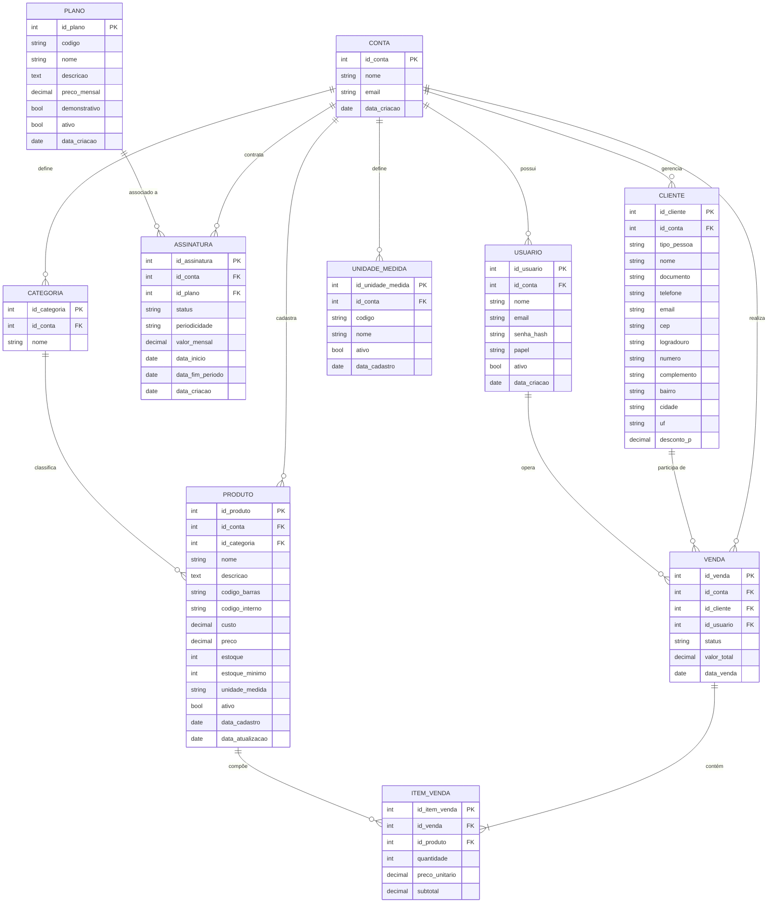

# Projeto Semestral – Etapa 1: Modelagem de Dados
## Sistema **Cora** — Gestão Empresarial para PMEs
**Alunos:** Atilano Faleiros · Neilon Jefferson  
**Instituição:** Fatec Franca  
**Repositório:** https://github.com/HaruSoftware/CoraReact

---

## 1. Descrição do Contexto do Sistema

O **Cora** é uma plataforma web do tipo **SaaS (Software as a Service)** desenvolvida para atender micro, pequenas e médias empresas (PMEs) que precisam centralizar e digitalizar sua gestão comercial. A solução nasce da observação de que muitos empreendedores ainda controlam estoque, clientes e vendas por meio de cadernetas, planilhas ou softwares fragmentados e desatualizados.

O sistema adota uma **arquitetura multi-tenant (multi-conta)**: cada empresa que se cadastra possui uma "conta" isolada com seus dados — produtos, clientes, usuários, vendas — completamente separados das demais. Isso garante segurança e escalabilidade da plataforma.

### Tecnologias Utilizadas
| Camada | Tecnologia |
|--------|-----------|
| Front-end | React, TypeScript, Vite |
| Back-end | Node.js (Express) |
| Banco de Dados | PostgreSQL |
| Autenticação | JWT, Bcrypt, Google OAuth 2.0 |
| Hospedagem | Render (PaaS) |

### Módulos Funcionais

| Módulo | Descrição |
|--------|-----------|
| **Autenticação & Acesso** | Cadastro de empresa/usuário, login por e-mail/senha ou Google OAuth 2.0, sessão via JWT |
| **Planos & Assinaturas** | Gerenciamento de planos SaaS; uma conta deve ter assinatura ativa para acessar o painel |
| **Configurações da Conta** | Edição de dados da empresa; gerenciamento de colaboradores (usuários) com controle de permissões |
| **Catálogo de Produtos** | Cadastro, edição e exclusão de produtos com preço, estoque, categorias e unidades de medida |
| **Gestão de Clientes** | Cadastro de clientes (PF e PJ) com dados de contato e endereço |
| **Vendas (PDV)** | Emissão de vendas vinculadas a clientes e operadores, com itens, cálculo automático e baixa em estoque |
| **Painel & Indicadores** | Dashboard com métricas de vendas e alertas de estoque mínimo |

---

## 2. Principais Regras de Negócio

### RN01 — Multi-Tenancy (Isolamento por Conta)
Todo dado do sistema (produtos, clientes, vendas, usuários) está vinculado a uma **conta** (`id_conta`). Um usuário só acessa dados da sua própria conta; não há compartilhamento entre contas distintas.

### RN02 — Obrigatoriedade de Assinatura Ativa
Uma conta sem assinatura ativa **não pode acessar o painel**. Ao se cadastrar via Google OAuth, a conta e o usuário são criados, mas a assinatura não — o usuário é redirecionado para escolher e ativar um plano antes de continuar.

### RN03 — Planos Demonstrativos
Planos marcados como `demonstrativo = TRUE` são ativados imediatamente e **não geram cobrança** (`preco_mensal = 0`). São usados para validar a contratação.

### RN04 — Unicidade de Assinatura Ativa
Uma conta pode ter **no máximo uma assinatura com `status = 'ativa'`** ao mesmo tempo (índice único parcial `uq_assinatura_conta_ativa`). Assinaturas canceladas são mantidas no histórico.

### RN05 — Periodicidade Mensal
A periodicidade de assinatura é exclusivamente **mensal**. A data de fim do período deve ser sempre posterior à data de início.

### RN06 — Valor Snapshot da Assinatura
O campo `valor_mensal` na assinatura é um **snapshot** do preço no momento da ativação, garantindo que alterações futuras no plano não afetem contratos vigentes.

### RN07 — Markup de Produto (Calculado, Não Armazenado)
O markup do produto **não é armazenado** no banco de dados. Ele é calculado em tempo real como `custo / preço_venda`, exibido em percentual. O preço sugerido é calculado como `custo / (markup / 100)`.

### RN08 — Custo Não Negativo
O campo `custo` de produto tem valor padrão `0` e possui restrição `NOT NEGATIVE`. O campo `preco` é obrigatório e positivo.

### RN09 — Controle de Estoque Automático
Ao registrar uma venda, o sistema realiza a **baixa automática** no estoque dos produtos vendidos. Alerta de estoque mínimo é exibido no painel quando `estoque <= estoque_minimo`.

### RN10 — Itens de Venda com Preço Snapshot
O `preco_unitario` em `item_venda` é um snapshot do preço no momento da venda, garantindo integridade histórica.

### RN11 — Validação de Documento (CPF/CNPJ)
O campo `documento` do cliente é **opcional**. Quando informado, é **validado** conforme o `tipo_pessoa` (PF = CPF, PJ = CNPJ).

### RN12 — Permissões por Nível de Usuário
Usuários com papel de **criador** da conta têm acesso à "Zona de Perigo" (exclusão de conta, limpeza de dados). Demais colaboradores têm acesso restrito às operações do dia a dia.

### RN13 — Exclusão em Cascata
A exclusão de uma conta provoca a **remoção em cascata** de todos os seus dados dependentes (produtos, clientes, vendas, usuários, etc.) por restrições de integridade referencial.

### RN14 — Código Único de Plano
Cada plano possui um `codigo` **único** (ex: `"essencial"`) que serve como identificador textual para uso em integrações e lógica de negócio.

---

## 3. Diagrama Conceitual (Entidade-Relacionamento)

O diagrama conceitual apresenta as **entidades** do sistema, seus **atributos** e os **relacionamentos** entre elas, sem considerar a implementação física do banco.



### Descrição dos Relacionamentos

| Relacionamento | Cardinalidade | Descrição |
|----------------|--------------|-----------|
| CONTA → USUARIO | 1:N | Uma conta possui um ou mais usuários (colaboradores) |
| CONTA → ASSINATURA | 1:N | Uma conta pode ter várias assinaturas (histórico), mas apenas uma ativa |
| CONTA → CATEGORIA | 1:N | Uma conta define suas próprias categorias de produtos |
| CONTA → UNIDADE_MEDIDA | 1:N | Uma conta define suas próprias unidades de medida |
| CONTA → PRODUTO | 1:N | Uma conta cadastra seus próprios produtos |
| CONTA → CLIENTE | 1:N | Uma conta gerencia sua própria base de clientes |
| CONTA → VENDA | 1:N | Uma conta realiza suas próprias vendas |
| PLANO → ASSINATURA | 1:N | Um plano pode estar associado a várias assinaturas |
| CATEGORIA → PRODUTO | 1:N | Uma categoria classifica vários produtos |
| CLIENTE → VENDA | 1:N | Um cliente pode participar de várias vendas |
| USUARIO → VENDA | 1:N | Um usuário (operador) pode registrar várias vendas |
| VENDA → ITEM_VENDA | 1:N | Uma venda contém um ou mais itens |
| PRODUTO → ITEM_VENDA | 1:N | Um produto pode aparecer em vários itens de venda |

---

## 4. Diagrama Lógico

O diagrama lógico apresenta a estrutura das **tabelas**, com tipos de dados, **chaves primárias (PK)**, **chaves estrangeiras (FK)** e restrições de integridade, pronto para implementação em PostgreSQL.

### CONTA
| Coluna | Tipo | Restrições |
|--------|------|-----------|
| **id_conta** | SERIAL | PK, NOT NULL |
| nome | VARCHAR(150) | NOT NULL |
| email | VARCHAR(150) | NOT NULL, UNIQUE |
| id_usuario_criador | INTEGER | FK → USUARIO(id_usuario) |
| data_criacao | TIMESTAMP | NOT NULL, DEFAULT NOW() |

---

### PLANO
| Coluna | Tipo | Restrições |
|--------|------|-----------|
| **id_plano** | SERIAL | PK, NOT NULL |
| codigo | VARCHAR(40) | NOT NULL, UNIQUE |
| nome | VARCHAR(100) | NOT NULL |
| descricao | TEXT | NOT NULL |
| preco_mensal | NUMERIC(10,2) | NOT NULL, CHECK >= 0 |
| demonstrativo | BOOLEAN | NOT NULL, DEFAULT FALSE |
| ativo | BOOLEAN | NOT NULL, DEFAULT TRUE |
| data_criacao | TIMESTAMP | NOT NULL, DEFAULT NOW() |

---

### ASSINATURA
| Coluna | Tipo | Restrições |
|--------|------|-----------|
| **id_assinatura** | SERIAL | PK, NOT NULL |
| id_conta | INTEGER | FK → CONTA(id_conta) ON DELETE CASCADE |
| id_plano | INTEGER | FK → PLANO(id_plano) ON DELETE RESTRICT |
| status | VARCHAR(20) | NOT NULL, DEFAULT 'ativa', CHECK IN ('ativa', 'cancelada') |
| periodicidade | VARCHAR(20) | NOT NULL, DEFAULT 'mensal', CHECK = 'mensal' |
| valor_mensal | NUMERIC(10,2) | NOT NULL, CHECK >= 0 |
| data_inicio | DATE | NOT NULL, DEFAULT CURRENT_DATE |
| data_fim_periodo | DATE | NOT NULL, CHECK > data_inicio |
| data_criacao | TIMESTAMP | NOT NULL, DEFAULT NOW() |

> **Índice único parcial:** `UNIQUE (id_conta) WHERE status = 'ativa'`  
> Garante que cada conta tenha no máximo uma assinatura ativa simultaneamente.

---

### USUARIO
| Coluna | Tipo | Restrições |
|--------|------|-----------|
| **id_usuario** | SERIAL | PK, NOT NULL |
| id_conta | INTEGER | FK → CONTA(id_conta) ON DELETE CASCADE |
| nome | VARCHAR(150) | NOT NULL |
| email | VARCHAR(150) | NOT NULL, UNIQUE |
| senha_hash | VARCHAR(255) | NULL (nulo para usuários Google) |
| google_id | VARCHAR(100) | NULL, UNIQUE |
| papel | VARCHAR(20) | NOT NULL, DEFAULT 'colaborador' |
| ativo | BOOLEAN | NOT NULL, DEFAULT TRUE |
| data_criacao | TIMESTAMP | NOT NULL, DEFAULT NOW() |

---

### CATEGORIA
| Coluna | Tipo | Restrições |
|--------|------|-----------|
| **id_categoria** | SERIAL | PK, NOT NULL |
| id_conta | INTEGER | FK → CONTA(id_conta) ON DELETE CASCADE |
| nome | VARCHAR(100) | NOT NULL |

---

### UNIDADE_MEDIDA
| Coluna | Tipo | Restrições |
|--------|------|-----------|
| **id_unidade_medida** | SERIAL | PK, NOT NULL |
| id_conta | INTEGER | FK → CONTA(id_conta) ON DELETE CASCADE |
| codigo | VARCHAR(20) | NOT NULL |
| nome | VARCHAR(60) | NOT NULL |
| ativo | BOOLEAN | NOT NULL, DEFAULT TRUE |
| data_cadastro | TIMESTAMP | NOT NULL, DEFAULT NOW() |

---

### PRODUTO
| Coluna | Tipo | Restrições |
|--------|------|-----------|
| **id_produto** | SERIAL | PK, NOT NULL |
| id_conta | INTEGER | FK → CONTA(id_conta) ON DELETE CASCADE |
| id_categoria | INTEGER | FK → CATEGORIA(id_categoria) ON DELETE SET NULL |
| nome | VARCHAR(150) | NOT NULL |
| descricao | TEXT | NULL |
| codigo_barras | VARCHAR(50) | NULL |
| codigo_interno | VARCHAR(50) | NULL |
| custo | NUMERIC(10,2) | NOT NULL, DEFAULT 0, CHECK >= 0 |
| preco | NUMERIC(10,2) | NOT NULL, CHECK > 0 |
| estoque | INTEGER | NOT NULL, DEFAULT 0 |
| estoque_minimo | INTEGER | NOT NULL, DEFAULT 0 |
| unidade_medida | VARCHAR(20) | NOT NULL |
| ativo | BOOLEAN | NOT NULL, DEFAULT TRUE |
| data_cadastro | TIMESTAMP | NOT NULL, DEFAULT NOW() |
| data_atualizacao | TIMESTAMP | NOT NULL, DEFAULT NOW() |

> **Nota:** O markup é calculado em tempo real (`custo / preco * 100`) e **não é armazenado** no banco.

---

### CLIENTE
| Coluna | Tipo | Restrições |
|--------|------|-----------|
| **id_cliente** | SERIAL | PK, NOT NULL |
| id_conta | INTEGER | FK → CONTA(id_conta) ON DELETE CASCADE |
| tipo_pessoa | CHAR(2) | NOT NULL, CHECK IN ('PF', 'PJ') |
| nome | VARCHAR(150) | NOT NULL |
| documento | VARCHAR(20) | NULL (CPF ou CNPJ, validado quando informado) |
| telefone | VARCHAR(20) | NULL |
| email | VARCHAR(150) | NULL |
| cep | VARCHAR(10) | NULL |
| logradouro | VARCHAR(200) | NULL |
| numero | VARCHAR(20) | NULL |
| complemento | VARCHAR(100) | NULL |
| bairro | VARCHAR(100) | NULL |
| cidade | VARCHAR(100) | NULL |
| uf | CHAR(2) | NULL |
| desconto_p | NUMERIC(5,2) | NULL, DEFAULT 0 |

---

### VENDA
| Coluna | Tipo | Restrições |
|--------|------|-----------|
| **id_venda** | SERIAL | PK, NOT NULL |
| id_conta | INTEGER | FK → CONTA(id_conta) ON DELETE CASCADE |
| id_cliente | INTEGER | FK → CLIENTE(id_cliente) ON DELETE SET NULL |
| id_usuario | INTEGER | FK → USUARIO(id_usuario) ON DELETE SET NULL |
| status | VARCHAR(20) | NOT NULL, DEFAULT 'concluida' |
| valor_total | NUMERIC(12,2) | NOT NULL, DEFAULT 0 |
| data_venda | TIMESTAMP | NOT NULL, DEFAULT NOW() |

---

### ITEM_VENDA
| Coluna | Tipo | Restrições |
|--------|------|-----------|
| **id_item_venda** | SERIAL | PK, NOT NULL |
| id_venda | INTEGER | FK → VENDA(id_venda) ON DELETE CASCADE |
| id_produto | INTEGER | FK → PRODUTO(id_produto) ON DELETE RESTRICT |
| quantidade | INTEGER | NOT NULL, CHECK > 0 |
| preco_unitario | NUMERIC(10,2) | NOT NULL (snapshot do preço) |
| subtotal | NUMERIC(12,2) | NOT NULL (calculado: quantidade × preco_unitario) |

---

## 5. Visão Geral das Dependências (Chaves Estrangeiras)

```
PLANO ←─────────────── ASSINATURA ──────────────→ CONTA
                                                     │
                                 ┌───────────────────┤
                                 │                   │
                              USUARIO             CATEGORIA
                              CLIENTE          UNIDADE_MEDIDA
                              PRODUTO ←─ CATEGORIA
                                 │
                              VENDA ─→ ITEM_VENDA ─→ PRODUTO
```

| Tabela Dependente | Referencia | Ação ao Deletar |
|-------------------|-----------|-----------------|
| ASSINATURA | CONTA | CASCADE |
| ASSINATURA | PLANO | RESTRICT |
| USUARIO | CONTA | CASCADE |
| CATEGORIA | CONTA | CASCADE |
| UNIDADE_MEDIDA | CONTA | CASCADE |
| PRODUTO | CONTA | CASCADE |
| PRODUTO | CATEGORIA | SET NULL |
| CLIENTE | CONTA | CASCADE |
| VENDA | CONTA | CASCADE |
| VENDA | CLIENTE | SET NULL |
| VENDA | USUARIO | SET NULL |
| ITEM_VENDA | VENDA | CASCADE |
| ITEM_VENDA | PRODUTO | RESTRICT |
